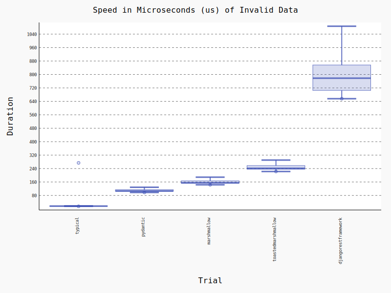

# Why `typical`?

There are many libaries out there that do some or most of what
`typical` can do. Why should you pick `typical` out of the pack?
Here's a short list:

1. Simplicity. 

- `typical` doesn't require you to learn a new DSL - all you need to
  know is how to use Python's standard type-annotations.

2. No Metaclasses.
    
- `typical` doesn't use metaclasses. We don't infect your inheritance.
  When you wrap a class with `@typic.al`, the class you get is the one
  you defined. That's it.

3. Flexibility.

- `typical` works for you and doesn't enforce arbitrarily strict
  rules.
- Because of an emphasis on simplicity and an aversion to
  inheritance-mangling, you're free to use this library as it works
  for your use-case.

4. Performance.

- `typical` is the fastest pure-Python (no Cython!) library out there.
  Just check out the histogram below:

